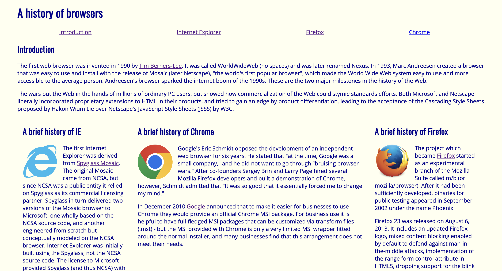
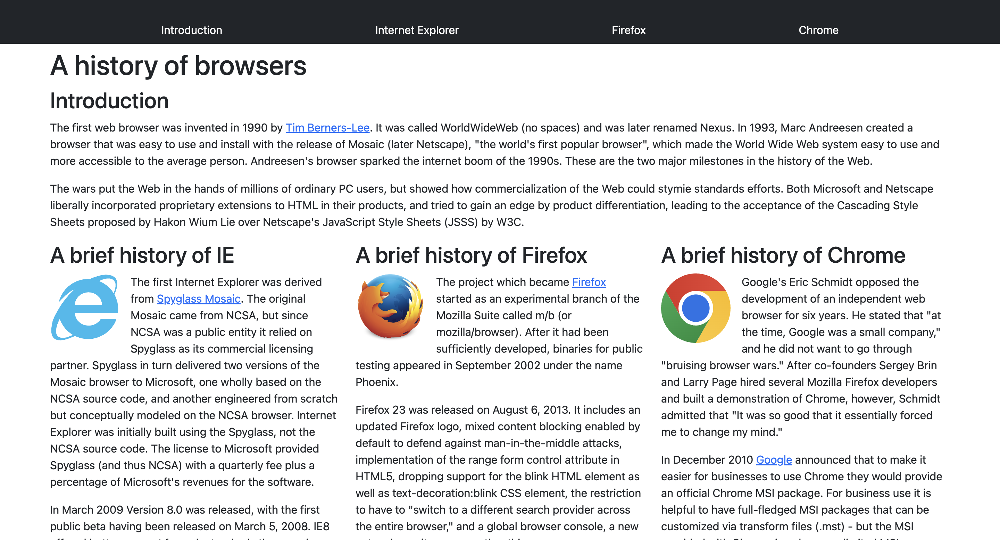

<h2>Introduction</h2>

When learning HTML and CSS, you’re introduced to many new and unfamiliar terms, which can be vastly overwhelming at first. And not just overwhelming; while building a website from scratch can be fun and a rewarding process, it can also be very time-consuming and frustrating. Adding a UI framework like Bootstrap 5 into the mix at first might feel like you’re just adding yet another layer of complexity, all of which seem to be doing the same thing your raw HTML and CSS files already do. If that’s the case, why bother learning Bootstrap 5 and putting yourself through more frustration?

  <h2>My Experience</h2>
  

    

      
      
My first experience with HTML was when I created a website for my ICS 314 course. It was titled “A history of browsers,” and was a simple site with basic styling. As a beginner in HTML, I found it challenging to get things right. Not long after this project, I was introduced to Bootstrap 5 and given the task of creating “A history of browsers” once again, but this time using the framework to manage the layout. It was while working on this project that I realized how useful a tool like Bootstrap could be.
      

    

    

      
      
Yes, I could have recreated this site using only HTML and CSS, but the time and effort it would have taken would have been immense, and the process far more complicated. With Bootstrap 5, I was able to use predefined components—such as navigation bars, buttons, and grids—to speed up the process, making it much easier to recreate the website. Instead of spending hours adjusting the padding and margins to get the layout just right, I relied on Bootstrap 5 built-in features to handle these details, which allowed me to complete the project quickly and efficiently.
      

    

  

<h2>Conclusion</h2>

While it may seem pointless at first to learn frameworks like Bootstrap, or you may feel it’s too complicated compared to sticking with just raw HTML and CSS, the benefits become clear the more you work with it. Bootstrap enables you to work faster without sacrificing quality, making it a powerful tool that enhances the capabilities of HTML and CSS. In return for learning Bootstrap 5, you gain the ability to efficiently create polished, professional designs in less time, with far less frustration. Ultimately, the investment is well worth the time and effort.

