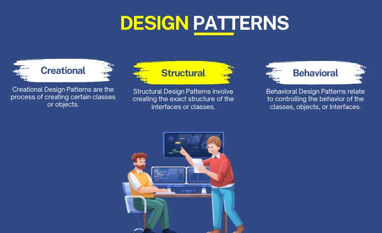

  

## Scenario
Your favorite coffee shop announces on social media that their new seasonal drinks are finally here, and everyone’s excited in the comments. You've been waiting all year for this, so you head straight there. You get to the shop and order a drink without thinking twice about it. You don’t care how the coffee is brewed, what beans they use, or the tea blend—you just tell the barista what you want, and let them handle the rest.

While sipping your drink and listening to the music playing from the coffee shop’s single music system, you connect to the free Wi-Fi that everyone in the shop uses. You check your emails and get some work done.

## Design Patterns
Pretty relaxing scenario, right?

These are some examples of a few common design patterns: **Observer** (the social media announcement), **Factory** (getting your drink without worrying about how it's made), and **Singleton** (the one music system and Wi-Fi everyone shares).
To be honest, throughout my coding journey I haven’t really put much thought into design patterns, but the more I learn about them, the more I realize I’ve been using them without even knowing it.

When I first started with my intro to Java course, one of the things I learned was how to create different types of objects depending on the input the user provides. This led me straight into the **Factory** design pattern. Essentially, this pattern lets you create objects without needing to know exactly what type you're creating ahead of time.

Then, when I started working with GUIs, I stumbled across the **Observer** pattern. This one involves setting up listeners for events, like a button click or text field change. For example, I built a form where clicking a button would trigger a popup or change the display. The cool thing about the Observer pattern is that it lets your program “watch” for these events and respond to them right away.

Lastly, there’s the **Singleton** pattern. I ran into this when I was working on projects that needed to share resources, like a database connection. The Singleton pattern makes sure there’s only one instance of something, which is perfect for when you want to avoid conflicts or duplication.

## Conclusion
Overall, design patterns are something that I will want to keep in mind as I continue my coding journey—to allow me to write code that is more flexible and easier to maintain, which is exactly what you need when working on bigger projects.

