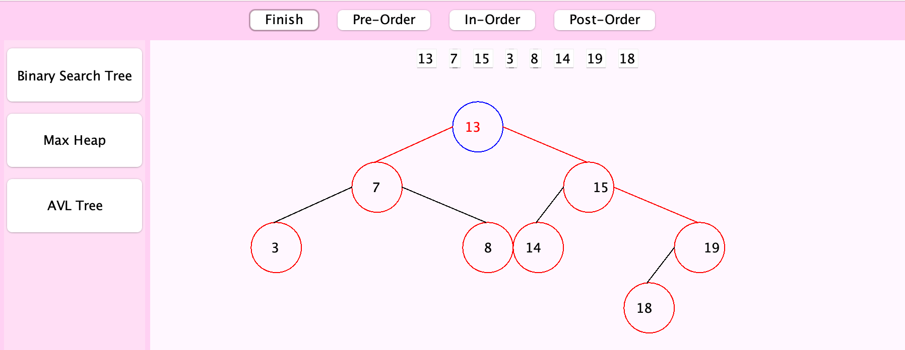

<div class="text-center p-4">
  
</div>

My first personal project in Java outside of classwork. While the BST section is complete, the Max Heap and AVL Tree sections are largely a work in progress. The entire program may be reworked entirely eventually as I was very much a beginner.

Created with Java Swing and AWT to guide ICS students through learning and understanding binary search trees and the traversals. Swing and AWT were utilized for the graphics. The program also features a working login system, where users are able to create accounts and sign in to see their saved binary search trees for future reference.

How the program works:
Once the user logs in or makes an account, they are able to choose between a Binary Search Tree, Max Heap, or AVL Tree. The user can specify how many nodes are in the tree, enter the numbers, and watch as the program automatically creates the tree for them. The program also provides the preorder, inorder, and postorder traversals.

Here is some example code that illustrates how I developed the graphics.

```java
for (int j = 0; j < tokens.length; j++) {
  tempX = x;
  tempY = y;

  if (tokens[j].equals("left") || tokens[j].equals("left!")) {
    // manipulate x and y values
    // get width of node (visual)
		      		
    if (((x - textWidth) + 28) >= 320) {
      // manipulate x value
    }

    if (tokens[j].contains("!")) {	   	
      // draw oval
      // draw line connecting
    }
  }
```
