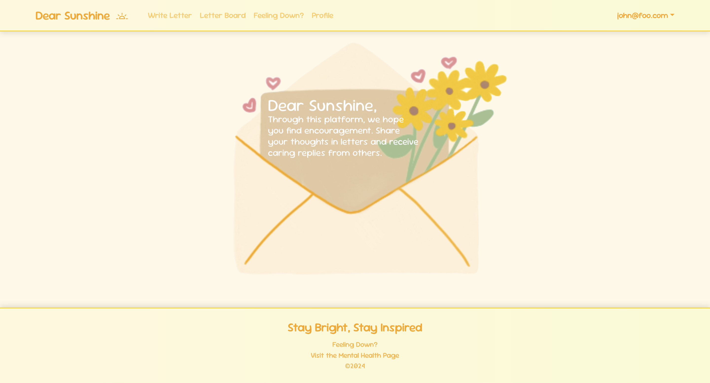
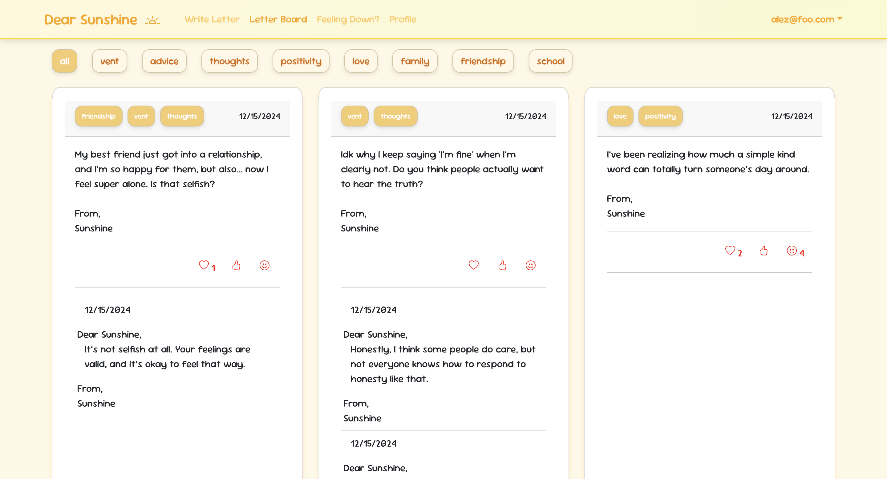

 
<strong>Dear Sunshine</strong> is a website designed to provide a safe space for those who may need it.
Whether you need a place to vent, to seek advice, or if you just wish to share an accomplishment, write a letter to Sunshine and receive encouraging, uplifting replies to brighten your day.
 
 

  

    
  

  

    
  

 

<h2>Features</h2>
<ul>
  <li><h3>Write Letter</h3>
  Write a letter to Sunshine expressing your thoughts, feelings, or whatever strikes you at the moment. Enhance your letter by adding tags corresponding to your letter's mood.</li>
  <li><h4>Letter Board</h4>
  View letters created by yourself and others on the main letter board. Reply to letters to offer support, or simply react with emojis.</li>
  <li><h4>Feeling Down?</h4>
  A page that offers mental health tips and resources.</li>
  <li><h4>Profile</h4>
  Change your signature and view your letters and replies on your profile page.</li>
</ul>
 

<h2>Development</h2>
Dear Sunshine was created using React Bootstrap, Next.js, Typescript, and Prisma ORM over the span of one month. My team used Issue Driven Project Management (IDPM) to structure our project on GitHub, and divided the work between frontend and backend.
 
 

My contribution to this project mainly lied in backend development, and I was responsible for the following features:
<li>filtering system where users can add tags to their letters</li>
<li>moderation system to prevent users from creating letters or replies with inappropriate words or phrases</li>
<li>reaction system where users can react to each letter with one or more emojis</li>
<li>pagination for both letters and replies on the letter board</li>
 
I also contributed to frontend development as well, working with my teammates to achieve a consistent, clean look throughout our website. 

<h2>Links</h2>
<ul>
  <li><a href="https://dearsunshine.vercel.app/">Dear Sunshine</a></li>
  <li><a href="https://dear-sunshine.github.io/">Project Homepage</a></li>
  <li><a href="https://github.com/dear-sunshine">Organization Homepage</a></li>
   
</ul>
