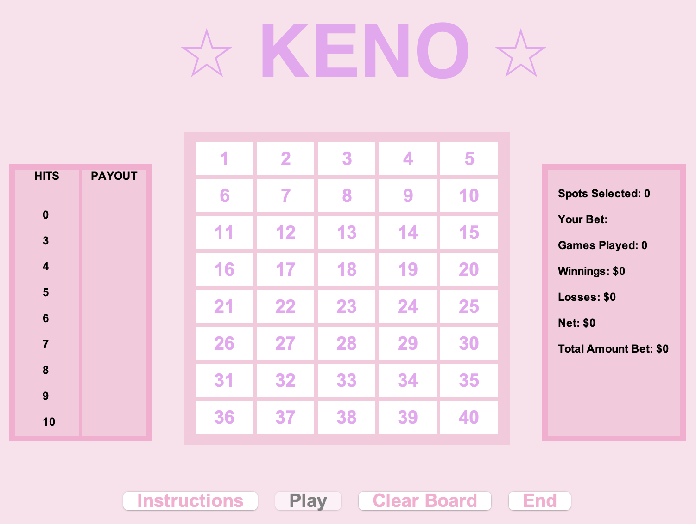

<div class="text-center p-4">
  
</div>

Keno is a lottery-style gambling game. In most version of Keno, you are able to choose 20 numbers out of 80. The winning numbers are drawn randomly, and the payout depends on how many of your selected numbers were drawn.

My version of Keno has shortened this to choose 10 numbers out of 40 for the sake of simplicity (and size of the window!).

This assignment was one of the first "big" assignments for my ICS 211 class, and it was also one of my first times creating a GUI. My professor's expectations for this assignment were very basic, but I wanted to challenge myself to create something that was not only fun and functional, but also visually pleasing - to me, at least.

Here is some code that illustrates how I determined the drawing

```java
do {
  // generate random number for drawing

  for (int i = 0; i < drawn.length; i++) {
    if (num == drawn[i]) {
      // checking for duplicates
    }
  }

  // if number drawn is not a duplicate
  if (!numExists) {
  if (BUTTON_ARR[num - 1].isSelected()) {
    // turn all matched buttons green
    // add to array of matched buttons
  } else {
    // number drawn but user did not choose - turn blue
  }

  for (JButton button : BUTTON_ARR) {
    // turn all user chosen numbers red
  }
```
