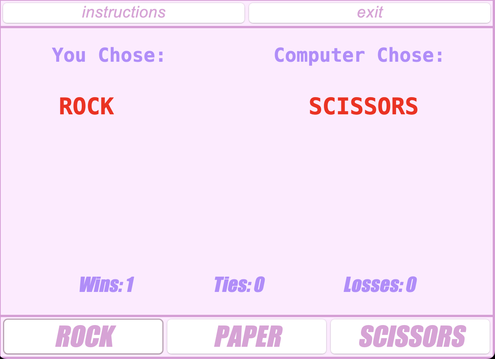

<div class="text-center p-4">
  
</div>

A simple implementation of Rock Paper Scissors created with Java Swing. This was created as an example of a GUI in Java that I could quickly refer to when students would seek tutoring with me for this specific assignment.

Here is some code that illustrates how I display the user's choice, the computer's choice, as well as increment the game stats.

```java
public void userChose(String option) {
  userPick.setText(option);
  getCompChoice();
}

public void getCompChoice() {
  Random rand = new Random();
  int compChoice = rand.nextInt(3);

  compPick.setText(choices[compChoice]);
  incrementStats(compPick.getText());
}

public void incrementStats(String comp) {
  this.count++;

  userStats.setText("Games Played: " + this.count);
  String result = determineWinner(userPick.getText(), comp);

  if (result.equals(TIE)) {
    this.ties++;
  } else if (result.equals(USER)) {
    this.wins++;
  } else {
    this.losses++;
  }

  userTies.setText("Ties: " + ties);
  userWins.setText("Wins: " + wins);
  userLosses.setText("Losses: " + losses);
}
```
